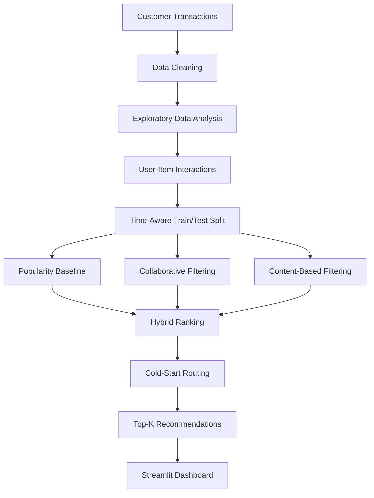

# 🛍️ Personalized E-Commerce Recommendation Engine

### AI-powered product recommendations from customer purchase behavior


---

## 🚀 Overview

This project is an end-to-end recommendation system that suggests relevant
products to individual customers based on their purchase history and product
characteristics. It's built on the **UCI Online Retail Dataset** — real
transactional data from a UK-based online gift retailer — rather than a
synthetic or pre-cleaned academic dataset.

The pipeline covers the full lifecycle a production recommender needs: raw
data cleaning, exploratory analysis, implicit-feedback modeling, four
distinct recommendation strategies, a time-aware evaluation framework, cold-start
handling, and an interactive dashboard for exploring results.

The goal isn't just a working model — it's a system that's honest about what
it can and can't do: where it has confidence in its recommendations, where
it's falling back to a safe default, and how well it actually performs by
measurable ranking metrics rather than assumption.

## 🎯 Problem Statement

E-commerce platforms lose engagement and revenue when customers can't easily
discover products relevant to them. Static category browsing and generic
best-seller lists don't scale to a large catalog or account for individual
preference.

## 💡 Solution

This engine combines multiple signals — what similar customers bought
(collaborative filtering), what a product is textually similar to (content-based
filtering), and overall popularity (baseline) — into a single hybrid ranking,
with automatic fallback logic for customers or products with no history yet.

## 🧠 Recommendation Architecture



## 🔥 Key Features

- 🧹 Full data cleaning pipeline for real, messy transactional data (cancellations, invalid entries, missing IDs)
- 📊 Purpose-driven EDA — every chart answers a specific modeling question, not decoration
- 🔁 Implicit feedback modeling (no star ratings in the source data — purchases and quantity are the signal)
- ⏱️ Time-aware train/test split to prevent data leakage
- 🧩 Four recommendation strategies: Popularity, Collaborative, Content-Based, Hybrid
- 🧊 Explicit cold-start handling for new customers and new products
- 📏 Ranking-appropriate evaluation: Precision@K, Recall@K, NDCG@K
- 🖥️ Interactive Streamlit dashboard with per-recommendation explanations

## 🤖 Recommendation Models

| Model | What it does | How it works | When it's useful |
|---|---|---|---|
| **Popularity Baseline** | Recommends the most broadly-purchased products | Ranks products by a weighted blend of total interaction volume and number of unique buyers | New customers with no purchase history (cold-start fallback) |
| **Collaborative Filtering** | "Customers like you also bought this" | Item-based cosine similarity over a user-item interaction matrix | Customers with an established purchase history |
| **Content-Based Filtering** | "Similar to what you've bought" | TF-IDF (unigrams + bigrams) over product descriptions, compared via cosine similarity | New products with zero purchase history, or reinforcing personalization with text signal |
| **Hybrid** | Blends collaborative and content signals | Weighted sum of normalized collaborative and content scores (default 60/40, tunable) | The primary recommender for customers with history — balances both signal types |

## 🧠 Machine Learning Techniques

- **Cosine Similarity** — measures the angle between two vectors, ignoring magnitude, so it captures shared interaction/text *pattern* rather than raw volume
- **TF-IDF** — weights words that are frequent in one product's description but rare across the whole catalog, so generic terms don't dominate similarity
- **Implicit Feedback** — treats purchase quantity/frequency as a preference signal, since explicit ratings aren't available
- **Hybrid Scoring** — normalizes and combines two independently-computed similarity signals into one ranked list
- **Cold-Start Handling** — routes unknown customers to the popularity baseline, and makes new products discoverable purely through content similarity
- **Ranking Evaluation** — Precision@K, Recall@K, and NDCG@K instead of classification accuracy

## 📈 EDA Highlights

**Dataset:**
- **Original rows:** 541,909 transactions (Dec 2010 – Dec 2011)
- **After cleaning:** 396,768 rows (27% removed: cancellations, invalid entries, non-product items)
- **Total interactions:** 294,813 customer-product pairs

**Key Metrics:**
- **User-item matrix sparsity:** 98.53% (very sparse — most customers buy few products)
- **Customers:** 4,338 unique (3,529 in train, 2,633 in test)
- **Products:** 3,662 unique (3,491 in train, 3,582 in test)
- **Cold-start customers (new):** 30.7% of test set
- **Cold-start products (new):** 5.8% of test set

**Distributions:**
- Long-tail product distribution: Top 20% of products drive 80%+ of interactions
- Customer purchase behavior: Median 8 products per customer, mean 67
- Temporal patterns: Stable transaction volume Dec 2010–Nov 2011, seasonal spikes observed (see `notebooks/` for charts)

## 📊 Evaluation

Recommendation is a ranking problem, not a classification problem, so this
project deliberately avoids accuracy as a metric:

- **Precision@K** — of the top K recommended items, what fraction were actually relevant
- **Recall@K** — of everything the customer actually interacted with next, what fraction did we surface in the top K
- **NDCG@K** — like Precision@K, but rewards relevant items appearing *higher* in the list, since users pay more attention to top results

### Results

| Model | Precision@10 | Recall@10 | NDCG@10 | Precision@20 | Recall@20 | NDCG@20 |
|-------|--------------|-----------|---------|--------------|-----------|---------|
| **Collaborative** | **0.083** | **0.046** | **0.112** | **0.070** | **0.081** | **0.113** |
| Hybrid | 0.079 | 0.051 | 0.111 | 0.069 | 0.084 | 0.112 |
| Content-Based | 0.040 | 0.032 | 0.052 | 0.031 | 0.051 | 0.052 |
| Popularity Baseline | 0.035 | 0.015 | 0.035 | 0.031 | 0.024 | 0.035 |

**Key Findings:**
- **Best performer:** Item-based Collaborative Filtering (NDCG@10: 0.112, Precision@10: 0.083)
- **Hybrid approach:** Nearly competitive with Collaborative (0.111 NDCG@10), combining both signals robustly
- **Cold-start handling:** Popularity baseline provides safe fallback for 30.7% of test customers (new users)
- **Evaluation method:** Time-aware train/test split (80% historical, 20% future) on 2.3K+ customers, 3.6K+ products

## 📈 Business Impact

- **Cross-selling** — frequently co-purchased product pairs surfaced directly from transaction data
- **Product discovery** — content-based filtering gives long-tail, rarely-purchased products a path to visibility
- **Customer retention** — personalized recommendations for repeat customers based on actual behavior
- **Personalized shopping experience** — recommendations come with a stated reason, not just a score
- Note: revenue/AOV impact would require live A/B testing against real traffic — this project reports offline ranking metrics only, and does not claim a revenue outcome it hasn't measured

## 🖥️ Dashboard

The Streamlit dashboard (`dashboard/app.py`) includes:

- **Overview** — KPIs (customers, products, transactions, model scores) and top products chart
- **Customer Explorer** — profile and purchase history for any customer, with spending totals and last purchase date
- **Recommendations** — personalized top-N picks as cards, each with a plain-language explanation of why it was recommended
- **Model Performance** — side-by-side comparison of all four models with Precision@K, Recall@K, NDCG@K metrics
- **Customer Insights** — purchase distribution, country breakdown, popularity scatter plot
- **About** — project overview and author info

**To run the dashboard:**
```bash
streamlit run dashboard/app.py
```

The dashboard gracefully handles missing artifacts — if files haven't been generated yet, it shows a setup screen with clear instructions rather than crashing or fabricating data.

### Dashboard Screenshots

For a complete walkthrough of capturing portfolio-ready screenshots, see [`DASHBOARD_SCREENSHOTS_GUIDE.md`](DASHBOARD_SCREENSHOTS_GUIDE.md).

**Recommended screenshots to capture (for `images/`):**

1. **`overview_kpis.png`** — Overview page showing KPI cards (4,338 customers, 3,662 products) and top products chart
   - Demonstrates project scale and data volume
   - Shows model performance metrics at a glance

2. **`customer_profile.png`** — Customer Explorer showing profile and purchase history
   - Displays individual customer data with spending totals
   - Proves real transactional data is present

3. **`recommendations_card.png`** — Recommendations page with personalized product suggestions
   - **Most impressive visual** — shows the recommendation engine in action
   - Displays human-readable explanations (60% collaborative + 40% content-based)
   - Shows ranking scores and recommendation method badges

4. **`model_comparison.png`** — Model Performance table and comparison chart
   - Displays all four models' metrics side-by-side
   - Highlights Collaborative Filtering as best performer (NDCG@10: 0.112)
   - Demonstrates rigorous evaluation methodology

Once captured, reference them in this README or use in presentations to showcase the project interactively.

## 🛠️ Tech Stack

| Category | Tools |
|---|---|
| Language | Python 3.9+ |
| Data Processing | Pandas, NumPy |
| Machine Learning | scikit-learn (TF-IDF, cosine similarity) |
| Visualization | Matplotlib, Seaborn, Streamlit native charts |
| Dashboard | Streamlit |
| NLP | NLTK (stopwords) |

## 📁 Project Structure

```
personalized-ecommerce-recommendation/
├── notebooks/                  # Full step-by-step analysis notebook
├── data/
│   └── README.md                # Dataset source + download instructions (raw data not committed)
├── src/
│   └── recommendation.py        # Popularity, collaborative, content-based, hybrid, evaluation logic
├── dashboard/
│   └── app.py                    # Streamlit dashboard
├── results/
│   └── model_comparison.csv     # Real evaluation output (generated by the notebook)
├── images/                       # Dashboard/EDA screenshots
├── requirements.txt
├── README.md
└── .gitignore
```

## ⚙️ Installation

```bash
git clone https://github.com/Amrutha-S8/personalized-ecommerce-recommendation.git
cd personalized-ecommerce-recommendation
pip install -r requirements.txt
```

Then download the dataset per `data/README.md`, and run the notebook in
`notebooks/` end-to-end — this generates the `artifacts/` folder the dashboard
depends on.

## ▶️ Run the Application

```bash
streamlit run dashboard/app.py
```

If `artifacts/` hasn't been generated yet, the dashboard will tell you exactly
which files are missing and how to produce them, rather than crashing or
showing placeholder data.

## 🔮 Future Improvements

- Matrix factorization (ALS / SVD) for a more scalable collaborative filtering approach
- Neural collaborative filtering
- Learned (rather than fixed) hybrid weights, tuned against validation NDCG
- Approximate nearest neighbor search (FAISS) for catalog-scale similarity lookups
- Real-time recommendation updates as new interactions arrive
- Live A/B testing to validate offline metrics against real engagement
- User and product embeddings in place of sparse similarity matrices

## ⚠️ Limitations

- No explicit ratings in the source data — implicit feedback (purchases) introduces noise, since a purchase doesn't always mean strong preference
- Content-based filtering relies on product titles only — no structured category, brand, or long-form description fields exist in this dataset
- Dataset is UK-dominated, limiting geographic generalization
- The item-item similarity matrix is dense and would need a sparse or ANN-based approach to scale to a much larger catalog

## 👩‍💻 Author

**Amrutha S.**
Computer Science Engineering — Data Science

GitHub: [https://github.com/Amrutha-S8](https://github.com/Amrutha-S8)
